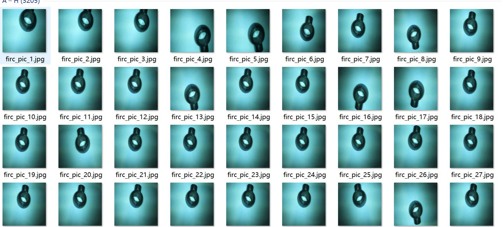
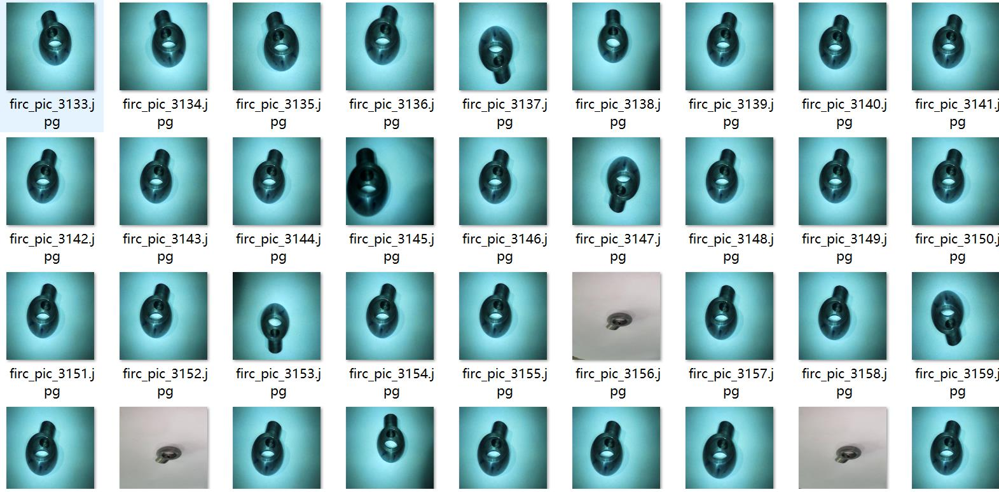
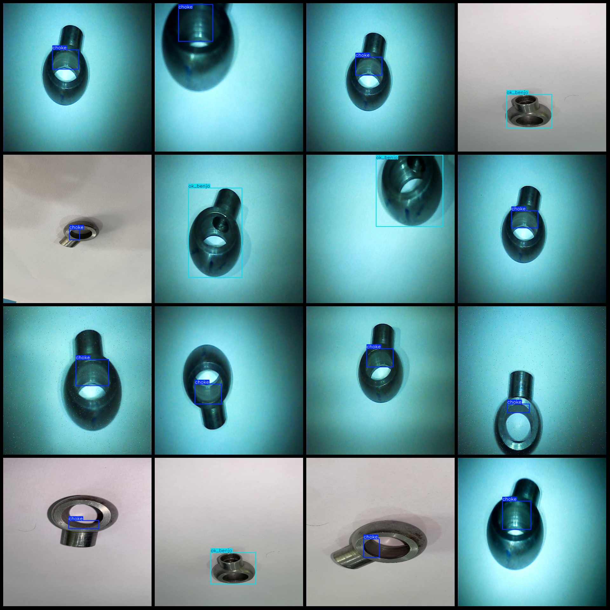
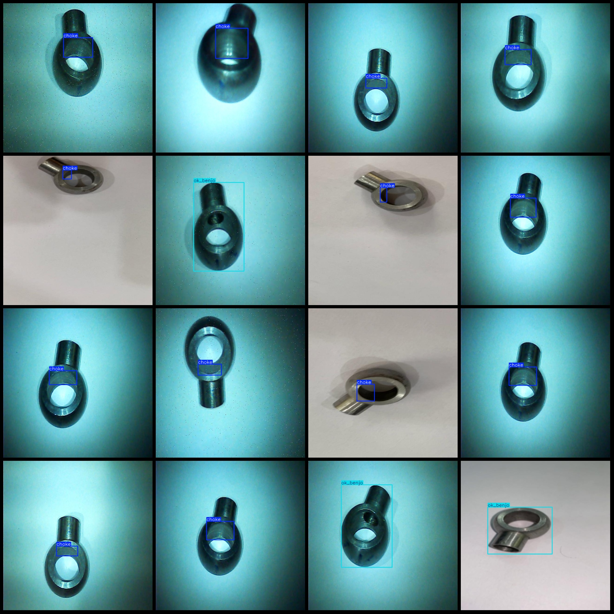

# Welded Ball Joint End Socket Flaw Detection Dataset VOC+YOLO Format with 3205 Images and 4 Categories

Dataset format: Pascal VOC format + YOLO format (txt file without split path, only containing jpg images and corresponding VOC format xml files and yolo format txt files)
Number of images (jpg file count): 3205
Number of annotations (xml file count): 3205
Number of annotations (txt file count): 3205
Number of categories: 4
Annotation category names: ["choke", "dent", "ok_benjo", "rust"]
Each category number of bounding boxes:
choke (blockage/choking) = 2575
dent (pitting) = 3
ok_benjo (good/acceptable) = 603
rust (rusting) = 28
Total bounding box count: 3209
Number of images per category:
choke (blockage/choking) = 2575
dent (pitting) = 2
ok_benjo (good/acceptable) = 603
rust (rusting) = 26
Image resolution: 640x640
Annotation tool used: labelImg
Annotation rule: draw bounding boxes for categories
Important notice: The dataset does not have been divided into training, validation, and test sets; please divide them yourself.
Special declaration: This dataset does not guarantee the accuracy of models or weight files trained on it.
Image preview:
Annotation example:

## Picture

Here is a pay link on Stripe ( https://buy.stripe.com/3cs8yP7sY87d0vu9AB ). Please contact me lonlonago@foxmail.com after funding $89, and I will send you a complete data files , thank you!

